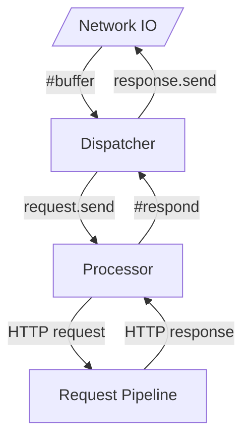

# coap-server

Provides an interface for handling and responding to CoAP requests.

* Dispatcher handles the protocol layer
  1. buffers incoming messages
  2. provides completed requests for processing
  3. buffers responses
  4. handles sending the response to the client
* Processor handles discrete requests
  1. takes a complete request
  2. transforms it for processing (HTTP request)
  3. response received from the request pipline
  4. response transformed for dispatch



## Installation

1. Add the dependency to your `shard.yml`:

   ```yaml
   dependencies:
     coap-server:
       github: spider-gazelle/coap-server
   ```

2. Run `shards install`

## Usage

```crystal
require "coap-server"
```

TODO: Write usage instructions here

## Contributing

1. Fork it (<https://github.com/spider-gazelle/coap-server/fork>)
2. Create your feature branch (`git checkout -b my-new-feature`)
3. Commit your changes (`git commit -am 'Add some feature'`)
4. Push to the branch (`git push origin my-new-feature`)
5. Create a new Pull Request

## Contributors

* [Stephen von Takach](https://github.com/stakach) - creator and maintainer
